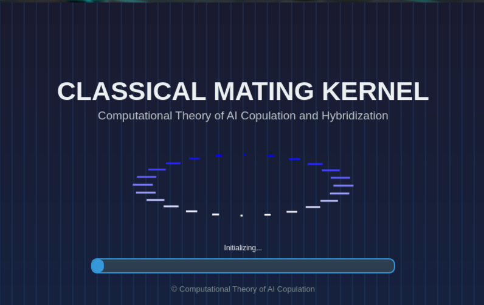
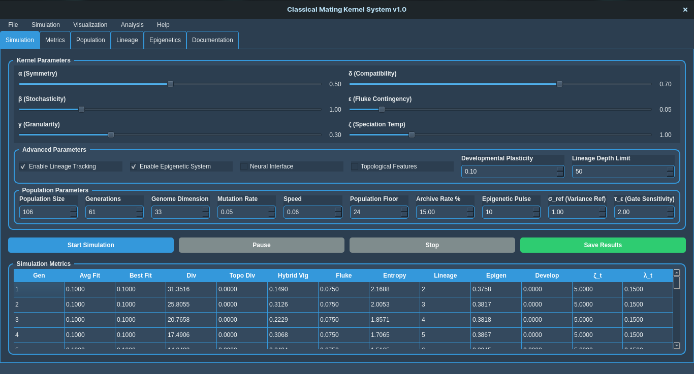
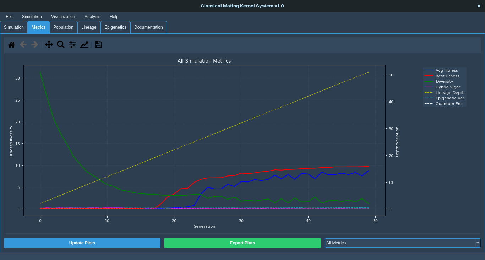
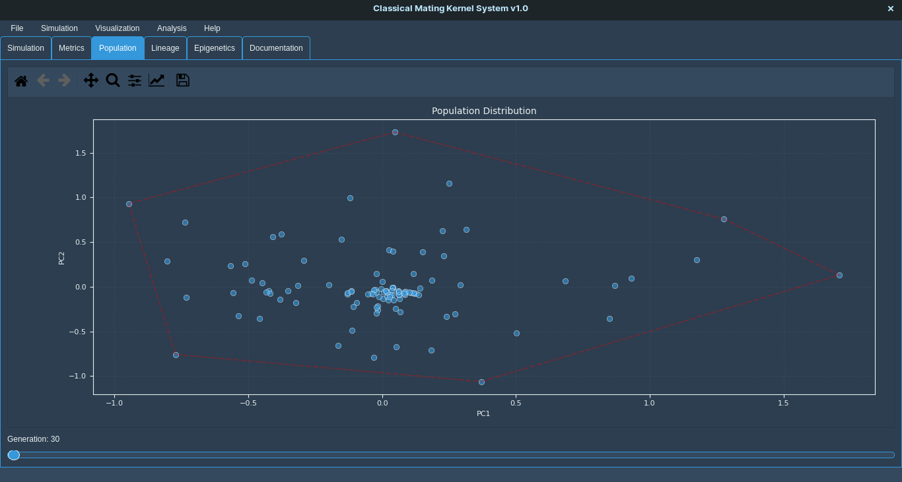
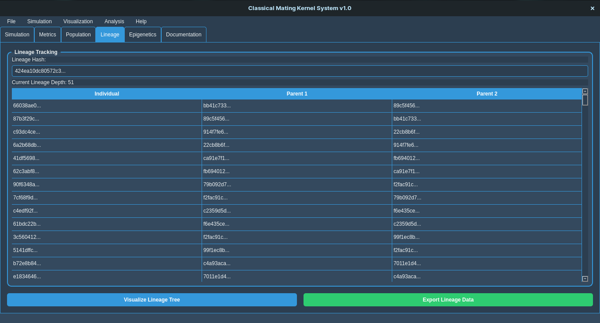

# Classical Mating Kernel System

A sophisticated lightweight PyQt5 desktop application implementing the **Computational Theory of AI Copulation and Hybridization**.  
Features lineage tracking, population simulation, epigenetic systems, neural interfaces.

- [Copulation Documentation](https://Artwell-XE.github.io/ai-copulation-theory/)

---

## Application Preview

| Splash Screen | Main Interface |
| :--- | :--- |
|  |  |
| *Start-up* | *Comprehensive control panel* |

| Metrics Dashboard | Population Analysis |
| :--- | :--- |
|  |  |
| *Live generation metrics* | *Interactive diversity analysis* |

| Lineage Tracking | Lineage Plot |
| :--- | :--- |
|  |  |
| *Cryptographic ancestry trees* | *Lineage analysis* |

---

## Features
- **6-D Mating Kernel** (α, β, γ, δ, ε, ζ)  
- **Cryptographic Lineage IDs**  
- **Reversible Epigenetic Switches**  
- **Neural Social-Genetic Interface**   
- **Topological Diversity Metrics**  
- **Ecological Kill-Switch**  

---

## Installation

### 1. System Dependencies
**Ubuntu/Debian**
```bash
sudo apt update && sudo apt install qt5-default python3-pyqt5 python3-dev
```

**macOS**
```bash
brew install qt5
```

**Windows**  
Install Qt5 from [qt.io](https://www.qt.io/download).

### 2. Python Environment
```bash
pip install -r requirements.txt
```

### 3. Launch
```bash
python3 main.py
```

---

## Usage

### Basic Operation
1. **Configure Parameters**: Adjust the 6-dimensional kernel parameters (α, β, γ, δ, ε, ζ)  
2. **Set Population Parameters**: Configure population size, generations, genome dimension  
3. **Enable Advanced Features**: Toggle lineage tracking, epigenetic system, neural interface  
4. **Start Simulation**: Click **Start Simulation** to begin evolutionary process  
5. **Monitor Progress**: View real-time metrics in the simulation tab  
6. **Analyze Results**: Use visualization and analysis tabs to explore results  

### Key Parameters
| Parameter | Range | Description |
|-----------|-------|-------------|
| **α (Symmetry)** | 0.0–1.0 | Balance of parental contributions |
| **β (Stochasticity)** | 0.0–5.0 | Mutation intensity |
| **γ (Granularity)** | gene / block / module | Recombination resolution |
| **δ (Compatibility)** | 0.0–1.0 | Minimum distance for hybridization |
| **ε (Fluke Contingency)** | 0.0–0.5 | Novelty injection rate |
| **ζ (Speciation Temperature)** | 0.0–5.0 | Selection pressure |

### Example Configurations
**Basic Evolutionary Optimization**  
```
α = 0.5, β = 1.0, γ = 0.3, δ = 0.7, ε = 0.05, ζ = 1.0
```

**Speciation Experiment**  
```
α = 0.7, β = 0.5, γ = 0.8, δ = 0.9, ε = 0.01, ζ = 0.3
```

**Innovation Search**  
```
α = 0.3, β = 2.0, γ = 0.2, δ = 0.5, ε = 0.1, ζ = 2.0
```

---

## Theoretical Foundations
The system implements formal theorems from the **Computational Theory of AI Copulation**:

1. **No-Free-Mating Theorem**: Universal copulation requires unbounded complexity  
2. **Hybrid Vigor Bound**: Fitness gain bounded by parental variance  
3. **Lineage Entropy Growth**: Guaranteed logarithmic emergence of novelty  

Each agent is defined by the extended tuple:  
`A = 〈g, ι, τ, ρ, θ, σ〉`

| Symbol | Meaning |
|--------|---------|
| `g` | Genotype (weights / circuits / programs) |
| `ι` | Immutable lineage identifier |
| `τ` | Epigenetic tag (reversible phenotypic switch) |
| `ρ` | Fitness scalar |
| `θ` | Learned reward model parameters |
| `σ` | Ecological safeguard meta-genes |

---

## File Structure
```
.
├── main.py                 # Main application entry point
├── requirements.txt        # Python dependencies
├── README.md               # This documentation file
└── templates/
    ├── documentation.html  # Theoretical documentation
    └── index.html          # Web interface template
```

---

## Advanced Features

### Ecological Safeguards
| Parameter | Default | Purpose |
|-----------|---------|---------|
| **Population Floor (N_min)** | 20 | Minimum population size |
| **Archive Rate (λ₀)** | 0.15 | Lateral gene transfer rate |
| **Epigenetic Refresh (T_pulse)** | 10 | Generations between epigenetic resets |
| **Kill-Switch Protocol** | — | Terminates pathological lineages |

### Export Capabilities
- **JSON** – Complete simulation data with metadata  
- **CSV** – Generation metrics and parameters  
- **Excel** – Multi-sheet analysis (needs `openpyxl`)  
- **Plots** – PNG / PDF / SVG at any resolution  

---

## Development

### Adding New Features
1. **New Parameters**: Add UI controls in `setup_simulation_tab()`  
2. **New Algorithms**: Extend `SimulationThread` methods  
3. **New Visualizations**: Create canvas classes and add to appropriate tabs  

### Code Structure
| Module / Class | Responsibility |
|----------------|----------------|
| `SimulationThread` | Core evolutionary algorithm |
| `ClassicalMatingKernelApp` | Main GUI application |
| `MplCanvas` | Matplotlib integration |
| `PopulationVisualization` | Population distribution plots |

---

## Troubleshooting

### Common Issues

**Qt5 Import Errors**
```bash
# Ubuntu / Debian
sudo apt-get install qt5-default

# macOS
brew install qt5
```

**Matplotlib Backend Issues**
```python
# Make sure Qt5Agg is used
import matplotlib
matplotlib.use('Qt5Agg')
```

**Memory Issues with Large Populations**
- Decrease population size or genome dimension  
- Raise kill-switch thresholds  
- Enable population floor safeguards  

### Performance Optimization
- Start with small population sizes  
- Reduce genome dimension for faster runs  
- Lower simulation speed parameter  
- Disable unused advanced features  

---

## License
GNU General Public License v3.0

---

## Citation
If you use this software in research, please cite:  
```
Mareya, L. A. (2025). Classical Mating Kernel: Computational Theory of AI Copulation and Hybridization.
```

---

## Support
1. Check the **Documentation** tab inside the application.  
2. Review `templates/documentation.html` for theoretical details.  
3. Try the example configurations above for common use cases.

---

## Contributing
Contributions are welcome!  
Please ensure new code respects the existing **ecological safeguards** and **kill-switch protocols**.
