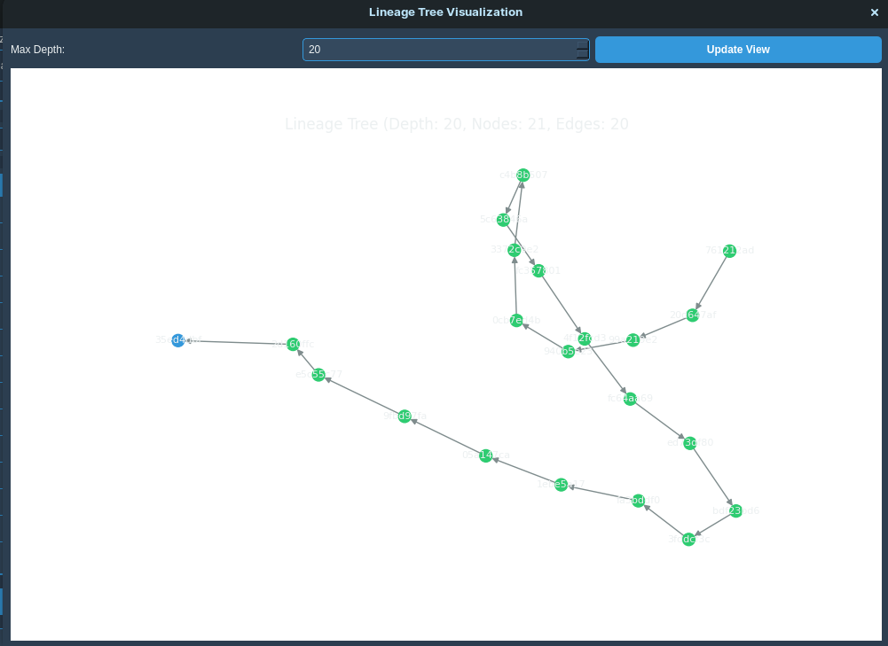

# Classical Mating Kernel System


*Advanced evolutionary computation with sophisticated visualization*

A sophisticated PyQt5 desktop application implementing the **Computational Theory of AI Copulation and Hybridization**.  
Features lineage tracking, epigenetic systems, neural interfaces, and quantum entanglement simulation.

---

## Application Preview

| Splash Screen | Main Interface |
| :--- | :--- |
|  |  |
| *Elegant DNA-helix start-up* | *Comprehensive control panel* |

| Metrics Dashboard | Population Analysis |
| :--- | :--- |
|  |  |
| *Live generation metrics* | *Interactive diversity analysis* |

| Lineage Tracking |
| :---: |
|  |
| *Cryptographic ancestry trees* |

---

## Features
- **6-D Mating Kernel** (α, β, γ, δ, ε, ζ)  
- **Cryptographic Lineage IDs**  
- **Reversible Epigenetic Switches**  
- **Neural Social-Genetic Interface**  
- **Quantum Entanglement & Non-local Correlations**  
- **Topological Diversity Metrics**  
- **Ecological Kill-Switch**  

---

## Quick Start

### 1. System Dependencies
**Ubuntu/Debian**
```bash
sudo apt update && sudo apt install qt5-default python3-pyqt5 python3-dev
```

**macOS**
```bash
brew install qt5
```

**Windows**  
Install Qt5 from [qt.io](https://www.qt.io/download).

### 2. Python Environment
```bash
pip install -r requirements.txt
```

### 3. Launch
```bash
python3 main.py
```

---

## Usage
1. Adjust the 6-D parameter sliders.  
2. Set population size & generations.  
3. Toggle lineage / epigenetic / neural features.  
4. **Start Simulation**.  
5. Monitor & export results via the **Analysis** tabs.

---

## Key Parameters
| Parameter | Range | Description |
|-----------|-------|-------------|
| **α Symmetry** | 0.0–1.0 | Balance of parental contribution |
| **β Stochasticity** | 0.0–5.0 | Mutation intensity |
| **γ Granularity** | gene / block / module | Recombination resolution |
| **δ Compatibility** | 0.0–1.0 | Min distance for hybridization |
| **ε Fluke Contingency** | 0.0–0.5 | Novelty injection |
| **ζ Speciation Temperature** | 0.0–5.0 | Selection pressure |

---

## File Structure
```
.
├── main.py
├── requirements.txt
├── README.md
└── templates/
    ├── documentation.html
    └── index.html
```

---

## License
GNU General Public License v3.0

---

> Mareya, L. A. (2025). *Classical Mating Kernel: Computational Theory of AI Copulation and Hybridization*.
```
